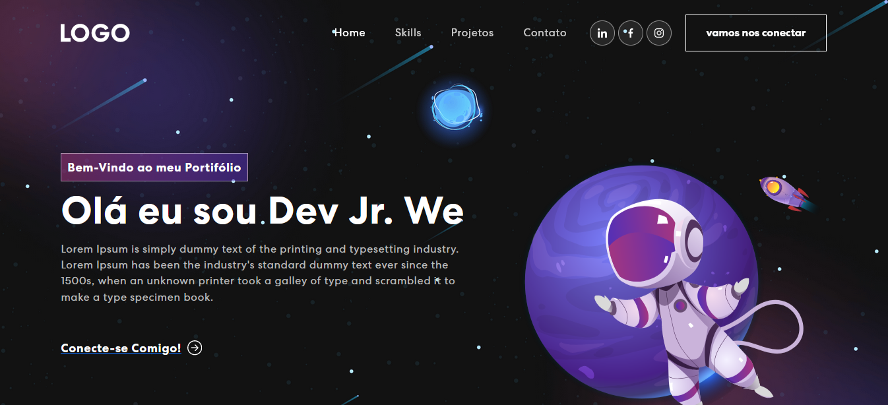

# Personal Portfolio Website in React

Este projeto foi inicializado com [Create React App](https://github.com/facebook/create-react-app).

Construído usando:

- Biblioteca front-end: React
- Framework CSS: React-bootstrap
- Biblioteca de animações CSS: Animate.css

No /personal-portfolio, você pode executar:

### `npm start`

Executa o aplicativo no modo de desenvolvimento.\
Abra [http://localhost:3000](http://localhost:3000) para visualizá-lo em seu navegador.

A página será recarregada quando você fizer alterações.\
Você também pode ver erros de lint no console.

### `npm test`

Inicia o executor de teste no modo de observação interativo.\

### `npm run build`

Cria o aplicativo para produção na pasta `build`.\
Ele empacota corretamente o React no modo de produção e otimiza a compilação para obter o melhor desempenho.

A compilação é minificada e os nomes dos arquivos incluem os hashes.\
Seu aplicativo está pronto para ser implantado!

